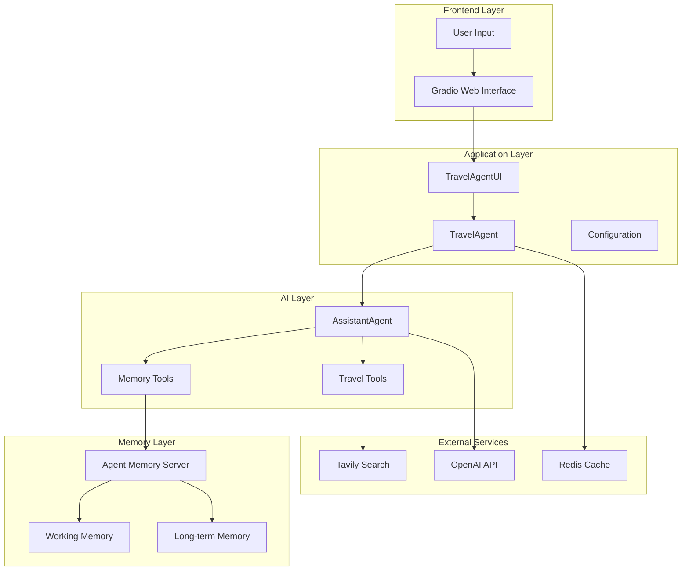
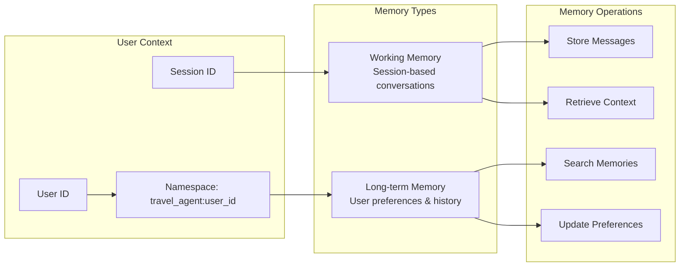
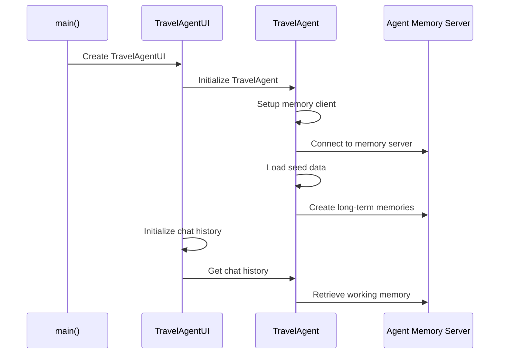
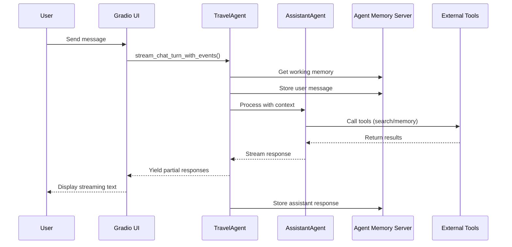
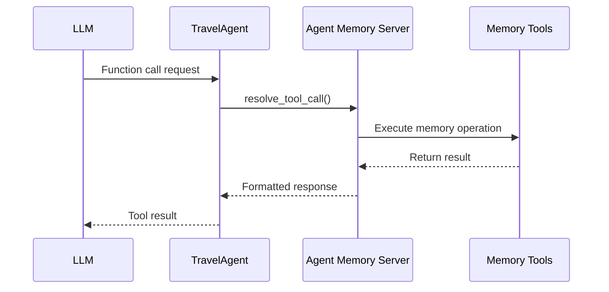
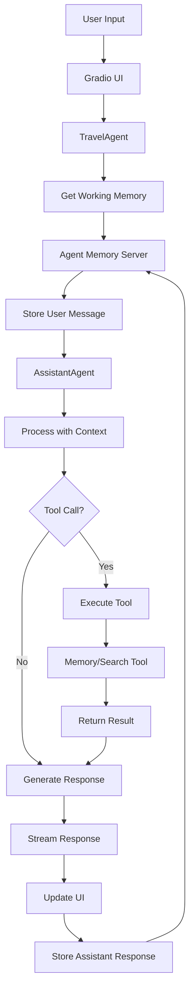
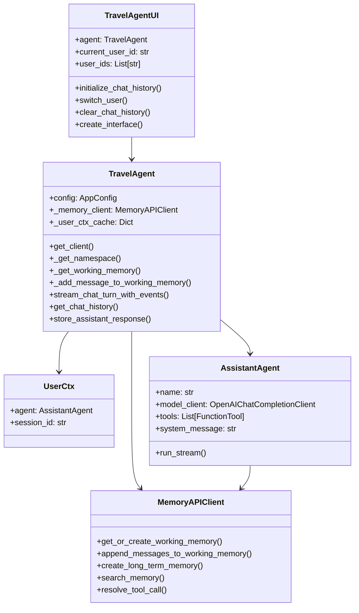

# Architecture Diagrams

## System Architecture

## Memory Architecture

## Application Initialization Flow

## Chat Flow

## Memory Tool Integration

## Data Flow

## Component Relationships

