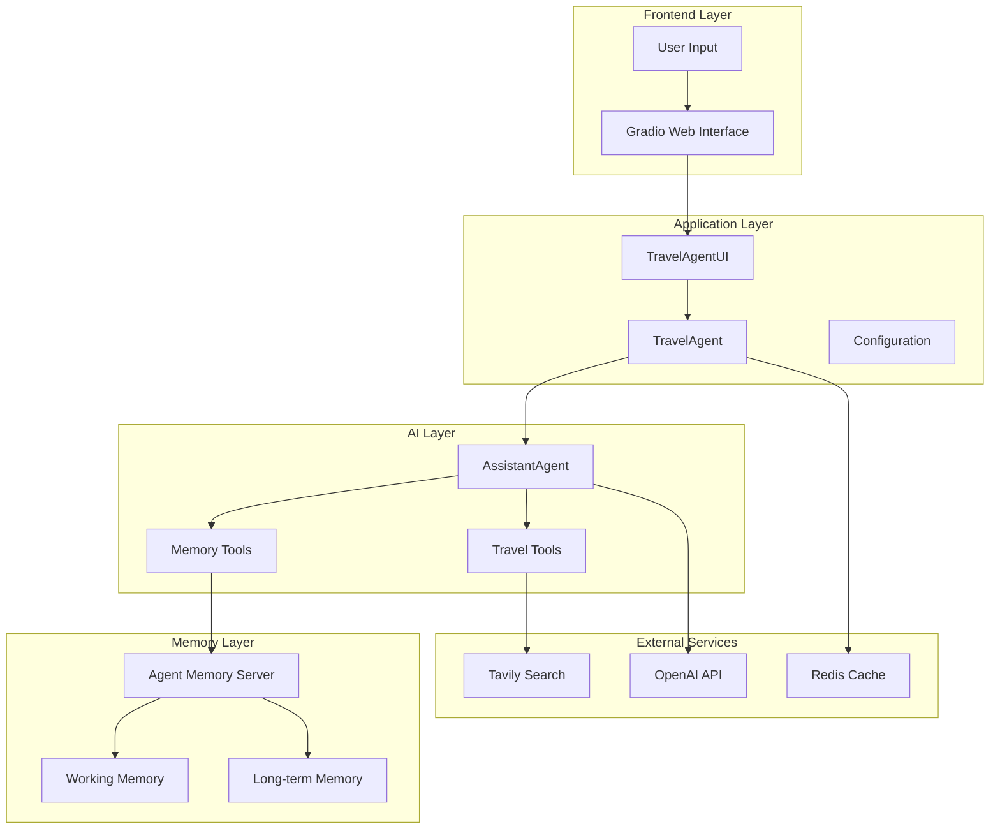
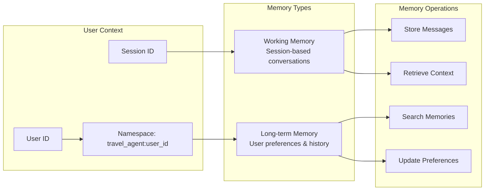
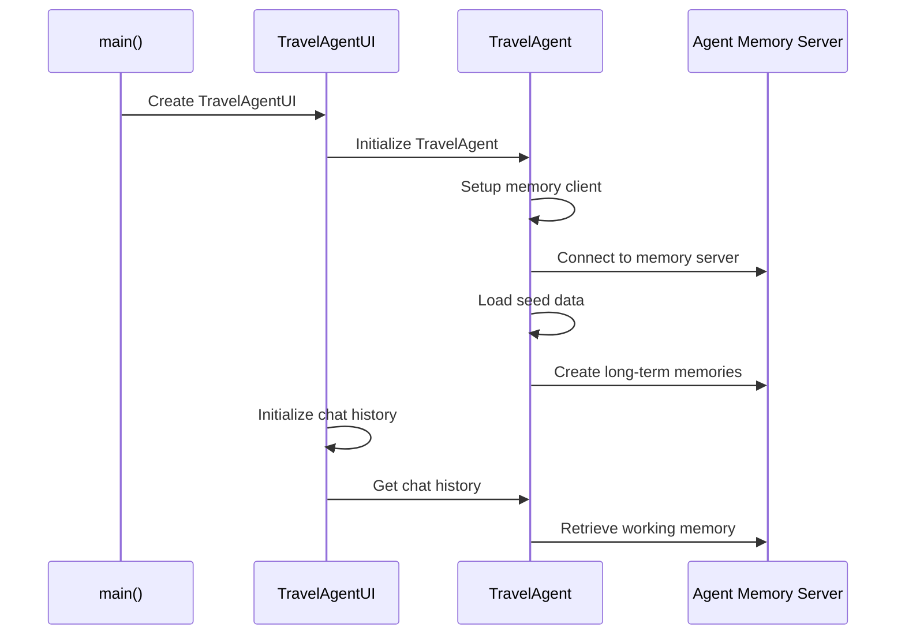
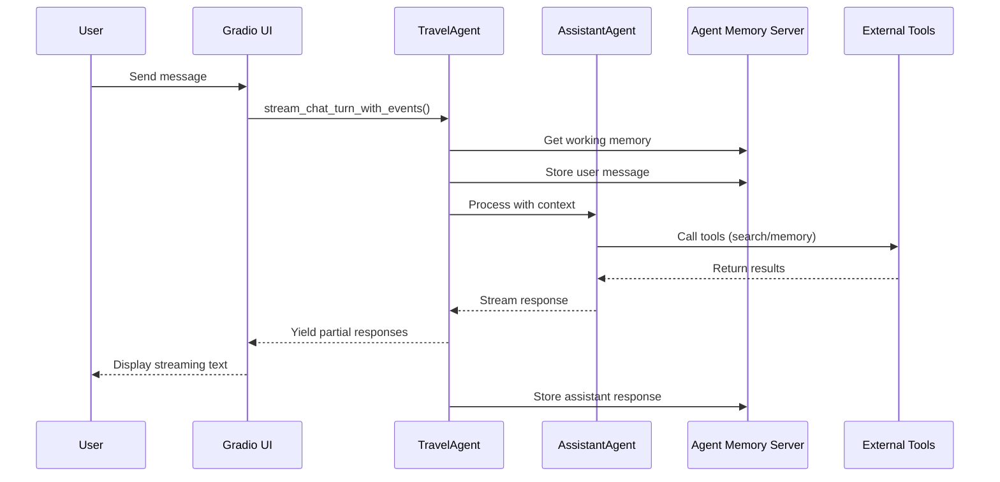
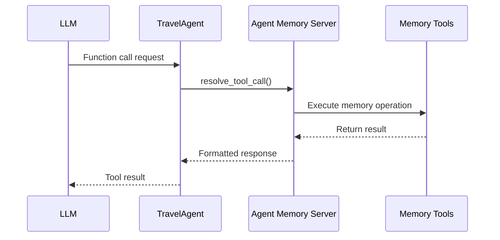

# AI Travel Concierge with Agent Memory Server

A sophisticated AI-powered travel planning assistant that leverages Agent Memory Server for both long-term and short-term memory management, providing personalized travel recommendations and itinerary planning.

## 📋 Table of Contents

- [Features](#-features)
- [Architecture Overview](#️-architecture-overview)
- [Code Flow](#-code-flow)
- [Project Structure](#-project-structure)
- [Documentation](#-documentation)
- [Quick Start](#-quick-start)
- [Configuration](#-configuration)
- [Memory System](#-memory-system)
- [Tools Available](#️-tools-available)
- [User Interface](#-user-interface)
- [API Reference](#-api-reference)
- [Testing](#-testing)
- [Troubleshooting](#-troubleshooting)
- [Performance](#-performance)
- [Contributing](#-contributing)
- [License](#-license)
- [Acknowledgments](#-acknowledgments)
- [Support](#-support)

## 🌟 Features

- **🧠 Intelligent Memory System**: Long-term memory for user preferences and past trips
- **💬 Session Management**: Working memory for conversation context
- **🔍 Real-time Search**: Web search integration for current travel information
- **📅 Calendar Generation**: Downloadable travel itineraries (.ics format)
- **👥 Multi-user Support**: Per-user namespace isolation
- **🎨 Modern UI**: Beautiful Gradio interface with Redis theme
- **⚡ Streaming Chat**: Real-time conversation with event logging

## 🏗️ Architecture Overview

### System Architecture



### Memory Architecture



## 🔄 Code Flow

### 1. Application Initialization



### 2. Chat Flow



### 3. Memory Tool Integration



## 📁 Project Structure

```
travel-concierge-agent-memory-server/
├── agent.py                 # Main TravelAgent class with memory integration
├── gradio_app.py           # Gradio web interface
├── config.py               # Configuration management
├── travel_agent.py         # Reference implementation
├── context/
│   ├── seed.json          # Initial user memories
│   └── redis_chat_completion_context.py  # Legacy Redis context
├── assets/
│   ├── styles.css         # UI styling
│   └── calendars/         # Generated calendar files
├── pyproject.toml         # Project dependencies
├── Makefile              # Build and run commands
├── README.md             # This file
├── ARCHITECTURE.md       # Detailed architecture diagrams
├── CODE_FLOW.md          # Code flow documentation
└── DEVELOPER_GUIDE.md    # Quick reference for developers
```

## 📚 Documentation

- **[README.md](README.md)** - This file, overview and quick start
- **[ARCHITECTURE.md](ARCHITECTURE.md)** - Detailed architecture diagrams and component relationships
- **[CODE_FLOW.md](CODE_FLOW.md)** - Comprehensive code flow documentation
- **[DEVELOPER_GUIDE.md](DEVELOPER_GUIDE.md)** - Quick reference for developers

## 🚀 Quick Start

### Prerequisites

- Python 3.12+
- Agent Memory Server running on `http://localhost:8000`
- OpenAI API key
- Tavily API key

### Installation

1. **Clone the repository**
   ```bash
   git clone <repository-url>
   cd travel-concierge-agent-memory-server
   ```

2. **Install dependencies**
   ```bash
   pip install -r requirements.txt
   # or using uv
   uv sync
   ```

3. **Set up environment variables**
   ```bash
   export OPENAI_API_KEY="sk-your-key-here"
   export TAVILY_API_KEY="your-key-here"
   export MEMORY_SERVER_URL="http://localhost:8000"
   ```

4. **Start Agent Memory Server**
   ```bash
   # In a separate terminal
   agent-memory-server
   ```

5. **Run the application**
   ```bash
   python gradio_app.py
   ```

6. **Access the web interface**
   Open `http://localhost:7860` in your browser

## 🔧 Configuration

### Environment Variables

| Variable | Description | Default |
|----------|-------------|---------|
| `OPENAI_API_KEY` | OpenAI API key for LLM | Required |
| `TAVILY_API_KEY` | Tavily API key for web search | Required |
| `MEMORY_SERVER_URL` | Agent Memory Server URL | `http://localhost:8000` |
| `TRAVEL_AGENT_MODEL` | OpenAI model for travel agent | `gpt-4.1` |
| `MAX_TOOL_ITERATIONS` | Maximum tool iterations | `8` |
| `MAX_CHAT_HISTORY_SIZE` | Maximum chat history size | `6` |
| `MAX_SEARCH_RESULTS` | Maximum search results | `5` |

### Configuration File

The `config.py` file manages all configuration settings using Pydantic:

```python
class AppConfig(BaseSettings):
    openai_api_key: str
    tavily_api_key: str
    memory_server_url: str = "http://localhost:8000"
    travel_agent_model: str = "gpt-4.1"
    max_tool_iterations: int = 8
    # ... more settings
```

## 🧠 Memory System

### Memory Types

1. **Working Memory**: Session-based conversation history
   - Stores user messages and assistant responses
   - Maintains conversation context
   - Automatically managed per session

2. **Long-term Memory**: Persistent user preferences and history
   - User travel preferences
   - Past trip information
   - Important details and insights

### Memory Operations

The system provides 9 memory management tools:

- `search_memory` - Find relevant past information
- `add_memory_to_working_memory` - Store session data
- `get_or_create_working_memory` - Manage conversation context
- `update_working_memory_data` - Update session information
- `create_long_term_memory` - Store persistent memories
- `search_long_term_memory` - Search user preferences
- `update_long_term_memory` - Modify existing memories
- `delete_long_term_memory` - Remove memories
- `clear_working_memory` - Clear session history

### Namespace Isolation

Each user gets a unique namespace: `travel_agent:{user_id}`

This ensures complete isolation between users' memories and conversations.

## 🛠️ Tools Available

### Travel Tools

1. **search_logistics** - Search for flights, hotels, and transport
2. **search_general** - Search for activities, attractions, and dining
3. **generate_calendar_ics** - Create downloadable travel itineraries

### Memory Tools

All 9 Agent Memory Server tools are available for the LLM to use automatically.

## 🎨 User Interface

### Features

- **Multi-user Support**: Switch between different user profiles
- **Real-time Chat**: Streaming responses with thinking animations
- **Event Logging**: Side panel showing agent activities
- **Calendar Integration**: Download and open travel itineraries
- **Modern Design**: Redis-themed dark UI with custom styling

### UI Components

- **Chat Interface**: Main conversation area
- **User Switcher**: Tab-based user selection
- **Agent Logs**: Real-time event monitoring
- **Calendar Controls**: Download and open calendar files

## 🔍 API Reference

### TravelAgent Class

#### Core Methods

```python
async def stream_chat_turn_with_events(user_id: str, user_message: str) -> AsyncGenerator
```
Stream chat responses with real-time events.

```python
async def get_chat_history(user_id: str, n: Optional[int] = None) -> List[Dict[str, str]]
```
Retrieve chat history for a user.

```python
async def store_assistant_response(user_id: str, response: str) -> None
```
Store assistant response in working memory.

#### Memory Methods

```python
async def get_client() -> MemoryAPIClient
```
Get the Agent Memory Server client.

```python
async def _get_working_memory(session_id: str, user_id: str) -> WorkingMemory
```
Get working memory for a session.

```python
async def _add_message_to_working_memory(session_id: str, user_id: str, role: str, content: str) -> None
```
Add a message to working memory.

## 🧪 Testing

### Manual Testing

1. **Memory Storage**: Send messages and verify they're stored
2. **Memory Retrieval**: Check if past conversations are remembered
3. **Tool Integration**: Test search and calendar generation
4. **Multi-user**: Switch between users and verify isolation

### Test Scenarios

```bash
# Test basic chat
"Plan a trip to Japan for 2 weeks"

# Test memory recall
"I mentioned I like sushi - what restaurants do you recommend?"

# Test calendar generation
"Create a calendar for my Tokyo itinerary"

# Test user switching
Switch to different user and verify separate memory
```

## 🐛 Troubleshooting

### Common Issues

1. **"Event loop is closed" error**
   - **Status**: Temporarily resolved by disabling memory storage
   - **Note**: Memory storage is currently disabled to avoid event loop conflicts

2. **Memory not persisting**
   - **Status**: Expected behavior - memory storage is temporarily disabled
   - **Workaround**: Memory tools still work for long-term memory operations

3. **Tool calls failing**
   - Check API keys are set correctly
   - Verify external services are accessible

### Debug Mode

Enable debug logging by setting environment variables:

```bash
export PYTHONPATH=.
export DEBUG=1
```

## 📈 Performance

### Optimizations

- **Memory Client Caching**: Shared client instance across users
- **Namespace Isolation**: Efficient per-user memory separation
- **Streaming Responses**: Real-time UI updates
- **Background Tasks**: Non-blocking memory operations

### Scalability

- **Multi-user Support**: Handles multiple concurrent users
- **Memory Server**: Centralized memory management
- **Redis Caching**: Fast user context retrieval

## 🤝 Contributing

1. Fork the repository
2. Create a feature branch
3. Make your changes
4. Add tests if applicable
5. Submit a pull request

## 📄 License

This project is licensed under the MIT License - see the LICENSE file for details.

## 🙏 Acknowledgments

- **Agent Memory Server**: For providing the memory management system
- **Autogen**: For the agent framework
- **Gradio**: For the web interface
- **OpenAI**: For the language models
- **Tavily**: For web search capabilities

## 📞 Support

For issues and questions:

1. Check the troubleshooting section
2. Review the logs for error messages
3. Open an issue on GitHub
4. Contact the development team

---

**Built with ❤️ using Agent Memory Server, Autogen, Gradio, and OpenAI**